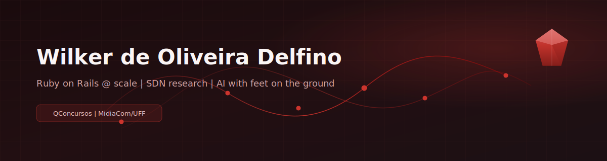

  

   

  
  
  

    

  

---

## Sobre

Engenheiro de software. Backend em escala, sistemas multi-tenant e decisões de arquitetura que precisam sobreviver ao crescimento.

Hoje:
- **QConcursos / QuestEdu** — Ruby on Rails em plataforma de educação em larga escala
- **MídiaCom / UFF** — pesquisa em redes definidas por software (SDN), recuperação de falhas e controladores distribuídos

Fora do horário comercial: PoCs com agentes de IA e automações — sempre separando demo de produção.

---

## Stack

  

| Área | Ferramentas |
| --- | --- |
| Backend | Ruby, Rails, Java |
| Dados / busca | OpenSearch, SQL, AWS |
| Plataforma | Docker, Kubernetes, Cloudflare Workers |
| Também | TypeScript, Python, Go — quando o problema pede |

---

## GitHub

  
  

 

  

 

  

---

## Pesquisa

Mestrado em Computação na **Universidade Federal Fluminense**, no grupo **MídiaCom**.

Foco: fault recovery em SDN e ambientes de teste para controladores distribuídos (ONOS / Atomix / Mininet).

- [mestrado](https://github.com/Wilker/mestrado) — bootstrap de cluster ONOS + Atomix + Mininet
- [Fault-Recovery-on-Software-Defined-Network](https://github.com/Wilker/Fault-Recovery-on-Software-Defined-Network)

---

## Como eu trabalho

- Menos é mais, a menos que a complexidade seja necessária
- Software pensado para larga escala desde o desenho
- Mudanças pequenas, revisáveis e rastreáveis
- Código e review críticos — inclusive do próprio trabalho

---

### Contato

 

Banner SVG local · widgets externos (stats / streak / activity) · ainda só em revisão local

